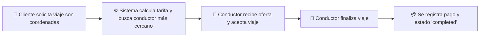

# 🚖 Plataforma de Transporte y Taxis - Arquitectura Limpia

Plataforma full-stack de gestión y despacho de taxis construida con **Clean Architecture (Arquitectura Limpia / Hexagonal)**, **Domain-Driven Design (DDD)**, **NestJS 11**, **PostgreSQL / TypeORM** y **React 19 + Leaflet**.

---

## 📚 Documentación del Proyecto

| Documento | Descripción |
| :--- | :--- |
| 📖 [**`USER_ROLES_AND_WORKFLOWS.md`**](file:///c:/HaptaxProjects/Arquitectura_Taxi_App/USER_ROLES_AND_WORKFLOWS.md) | **Guía completa de usuarios, roles (`client`, `driver`, `admin`), cuentas demo, flujos y fórmulas de tarifas.** |
| 🏛️ [**`ARCHITECTURE.md`**](file:///c:/HaptaxProjects/Arquitectura_Taxi_App/ARCHITECTURE.md) | **Detalle técnico de Clean Architecture, capas DDD, puertos, adaptadores y patrones GoF (Strategy, Factory, Repository).** |
| 🚀 [**`DEPLOYMENT_GUIDE.md`**](file:///c:/HaptaxProjects/Arquitectura_Taxi_App/DEPLOYMENT_GUIDE.md) | **Guía de despliegue 100% gratuito en Render (Backend), Vercel (Frontend) y Neon.tech (PostgreSQL).** |
| 🤖 [**`AGENTS.md`**](file:///c:/HaptaxProjects/Arquitectura_Taxi_App/AGENTS.md) | **Reglas, directivas de desarrollo y skills para asistentes de Inteligencia Artificial.** |

---

## 🛠️ Stack Tecnológico

### Backend (`taxi-backend`)
- **Framework Core**: [NestJS v11](https://nestjs.com/) (Node.js & TypeScript).
- **Lenguaje**: TypeScript 5.7.
- **Base de Datos**: PostgreSQL con [TypeORM v0.3](https://typeorm.io/).
- **Autenticación & Seguridad**: JWT (`@nestjs/jwt`), Hashing de contraseñas con `bcrypt`, `JwtAuthGuard`.
- **Validación de Datos**: `class-validator`, `class-transformer`.
- **Despliegue**: Render.com Web Service (`https://arquitectura-taxi-app.onrender.com`).

### Frontend (`taxi-frontend`)
- **Framework Core**: [React v19](https://react.dev/).
- **Build Tool**: [Vite v7](https://vitejs.dev/).
- **Lenguaje**: TypeScript 5.9.
- **Enrutamiento**: React Router DOM v7.
- **Mapas y Geolocalización**: [Leaflet v1.9](https://leafletjs.com/) y [React-Leaflet v5](https://react-leaflet.js.org/).
- **Consumo de API**: Cliente HTTP tipado con soporte JWT en LocalStorage.

---

## 🔑 Cuentas Demo para Probar la Aplicación

| Rol | Email | Password | Dashboard |
| :--- | :--- | :--- | :--- |
| 👑 **Administrador** | `admin@taxi.com` | `AdminPassword123!` | `AdminDashboard` |
| 👑 **Administrador 2** | `admin2@taxi.com` | `AdminPassword123!` | `AdminDashboard` |
| 🚖 **Conductor** | `chofer@demo.com` | `123456` | `DriverDashboard` |
| 👤 **Cliente** | `cliente@demo.com` | `123456` | `ClientDashboard` |

---

## 🔄 Flujo y Ciclo de Vida del Viaje



---

## 🚀 Inicio Rápido Local

### 1. Iniciar Frontend
```bash
cd taxi-frontend
npm install
npm run dev
```
Abre en tu navegador `http://localhost:5173`. Ya está preconfigurado para comunicarse con la API en la nube.
