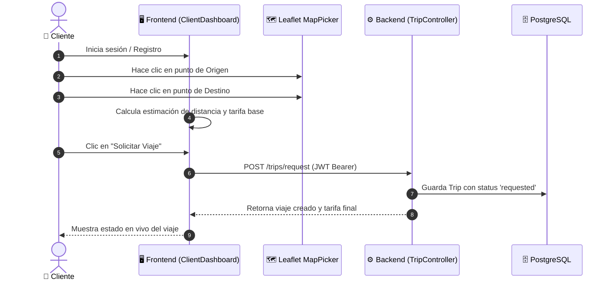
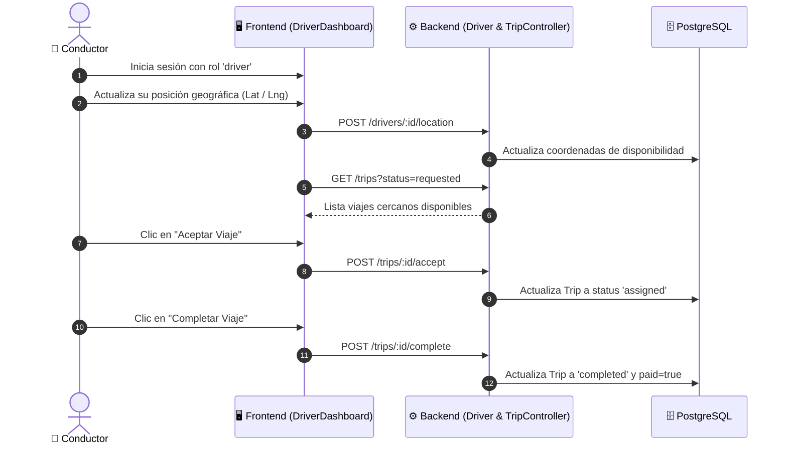
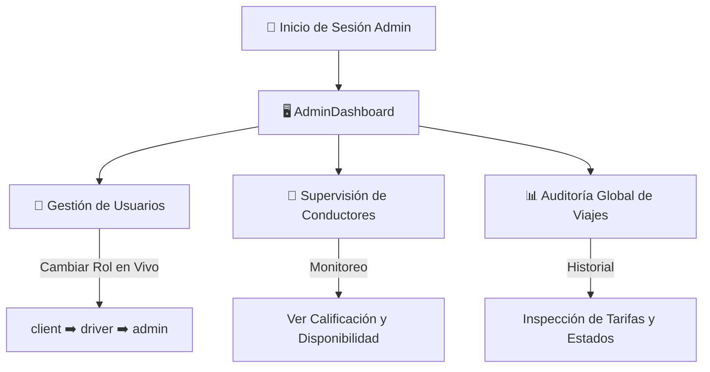
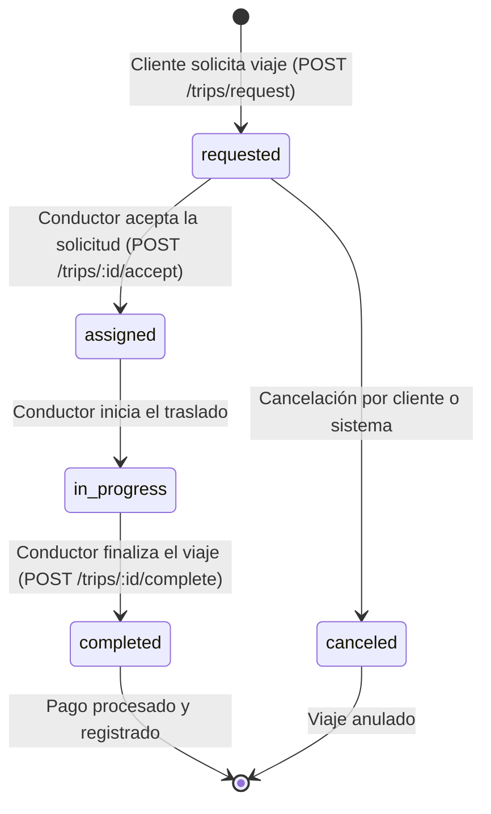

# 👥 Guía de Usuarios, Roles, Permisos y Funcionamiento

Este documento detalla el modelo de control de acceso basado en roles (**RBAC**), los flujos de interacción de cada tipo de usuario, las credenciales de prueba preconfiguradas para portafolio y el ciclo de vida operativo de la plataforma **Taxi App**.

---

## 📑 Tabla de Contenidos
1. [Matriz de Roles y Permisos](#-matriz-de-roles-y-permisos)
2. [Cuentas Preconfiguradas para Demostración](#-cuentas-preconfiguradas-para-demostración)
3. [Flujos Operativos por Rol](#-flujos-operativos-por-rol)
   - [3.1. Flujo del Cliente (`client`)](#31-flujo-del-cliente-client)
   - [3.2. Flujo del Conductor (`driver`)](#32-flujo-del-conductor-driver)
   - [3.3. Flujo del Administrador (`admin`)](#33-flujo-del-administrador-admin)
4. [Mecanismo de Asignación y Algoritmos](#-mecanismo-de-asignación-y-algoritmos)
5. [Cálculo de Tarifas Geográficas](#-cálculo-de-tarifas-geográficas)
6. [Diagrama de Estados del Viaje](#-diagrama-de-estados-del-viaje)

---

## 🛡️ 1. Matriz de Roles y Permisos

El sistema implementa un modelo de permisos granulares gestionado a través de la entidad de dominio `Profile` y la factoría `ProfileFactory`:

| Permiso Granular | Descripción | Cliente (`client`) | Conductor (`driver`) | Administrador (`admin`) |
| :--- | :--- | :---: | :---: | :---: |
| `request_trip` | Solicitar nuevos viajes con geolocalización | ✅ | ❌ | ❌ |
| `view_trips` | Consultar estado e historial de viajes propios | ✅ | ✅ | ✅ |
| `rate_driver` | Calificar al conductor tras completar el viaje | ✅ | ❌ | ❌ |
| `accept_trips` | Aceptar ofertas de viaje asignadas | ❌ | ✅ | ❌ |
| `update_location`| Actualizar coordenadas GPS en tiempo real | ❌ | ✅ | ❌ |
| `view_earnings` | Visualizar ingresos y viajes completados | ❌ | ✅ | ❌ |
| `manage_users` | Listar usuarios y modificar roles en el sistema | ❌ | ❌ | ✅ |
| `manage_system` | Registrar nuevos administradores y monitorear | ❌ | ❌ | ✅ |
| `view_reports` | Auditoría global de la plataforma | ❌ | ❌ | ✅ |

---

## 🔑 2. Cuentas Preconfiguradas para Demostración

Para facilitar pruebas y presentaciones ante reclutadores o clientes, existen las siguientes cuentas activas en la base de datos cloud:

```
+-----------------------------------------------------------------------------------------+
|                               CUENTAS DEMO ACTIVAS                                      |
+-------------------+-----------------------------+---------------------+-----------------+
| Rol               | Correo Electrónico          | Contraseña          | Dashboard       |
+-------------------+-----------------------------+---------------------+-----------------+
| 👑 Administrador  | admin@taxi.com              | AdminPassword123!   | AdminDashboard  |
| 👑 Administrador 2| admin2@taxi.com             | AdminPassword123!   | AdminDashboard  |
| 🚖 Conductor Demo | driver@demo.com             | Password123!        | DriverDashboard |
| 👤 Cliente Demo   | client@demo.com             | Password123!        | ClientDashboard |
+-------------------+-----------------------------+---------------------+-----------------+
```

---

## 🔄 3. Flujos Operativos por Rol

### 3.1. Flujo del Cliente (`client`)



1. **Selección en Mapa**: El cliente interactúa con el componente `MapPicker` (OpenStreetMap / Leaflet), seleccionando visualmente origen y destino.
2. **Cálculo de Tarifa**: La tarifa se estima dinámicamente según la distancia geográfica.
3. **Seguimiento de Estados**:
   - `requested`: Esperando que un conductor acepte.
   - `assigned`: Conductor asignado y en camino.
   - `completed`: Viaje finalizado con pago registrado.

---

### 3.2. Flujo del Conductor (`driver`)



1. **Disponibilidad**: El conductor activa su estado y actualiza sus coordenadas GPS.
2. **Recepción de Ofertas**: El sistema le presenta los viajes en estado `requested`.
3. **Ejecución y Cierre**: Acepta el viaje y, una vez en el destino, lo marca como `completed`.

---

### 3.3. Flujo del Administrador (`admin`)



1. **Gestión de Roles**: Permite ascender cualquier cuenta de `client` a `driver` o `admin` con un solo clic.
2. **Supervisión de Flota**: Consulta de calificaciones (`rating`), total de viajes realizados y disponibilidad de los conductores.
3. **Auditoría de Operaciones**: Visibilidad total de todos los viajes registrados en la plataforma.

---

## 🧮 4. Mecanismo de Asignación y Algoritmos

La plataforma implementa el **Patrón Estrategia (Strategy Pattern)** para decidir qué conductor recibe la oferta de viaje:

1. **`NearestDriverStrategy` (Por Cercanía Geográfica - Activa)**:
   - Filtra los conductores que tienen `isAvailable = true` y coordenadas válidas.
   - Calcula la distancia euclidiana entre las coordenadas del conductor y el punto de origen del cliente:
     $$\text{distancia} = \sqrt{(\text{lat}_{\text{driver}} - \text{lat}_{\text{origen}})^2 + (\text{lng}_{\text{driver}} - \text{lng}_{\text{origen}})^2}$$
   - Asigna el viaje al conductor con la menor distancia.

2. **`RatedDriverStrategy` (Por Calificación - Opcional)**:
   - Ordena los conductores disponibles por su puntaje (`rating`) de 1 a 5 estrellas y selecciona al mejor calificado.

---

## 💵 5. Cálculo de Tarifas Geográficas

El precio de cada viaje se calcula en el caso de uso `RequestTripUseCase` aplicando la fórmula de distancia por grado geográfico:

$$\text{Distancia en Km} \approx \sqrt{(\Delta \text{Lat})^2 + (\Delta \text{Lng})^2} \times 111\text{ km}$$

$$\text{Tarifa Total} = \max\left(\text{Tarifa Base} + (\text{Km} \times \text{Precio por Km}),\; \text{Tarifa Mínima}\right)$$

- **Tarifa Base**: \$3.00
- **Precio por Km**: \$8.00
- **Tarifa Mínima**: \$3.00 (o tarifa fallback de \$10.00 si no se envían coordenadas).

---

## 🚦 6. Diagrama de Estados del Viaje


